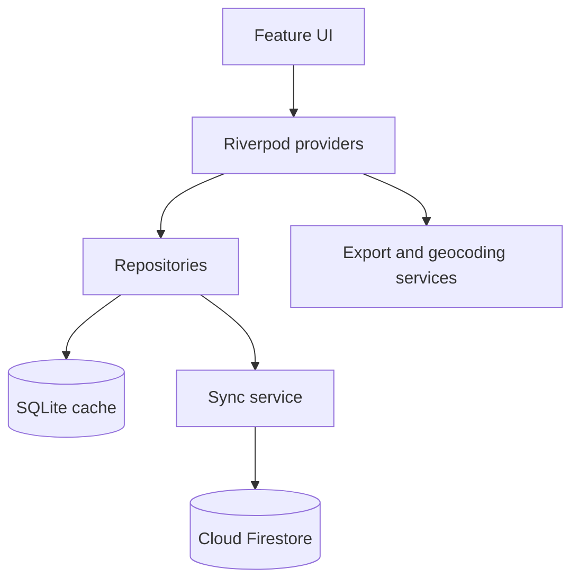

# AZS App

[](https://github.com/Yaroslavgiv/azs_lucom/actions/workflows/flutter.yml)


Offline-first Flutter-приложение для учёта заявок, технического обслуживания
и оборудования сети АЗС в Санкт-Петербурге и Новгородской области.

Проект демонстрирует прикладную Flutter-разработку: локальную реляционную БД,
двустороннюю синхронизацию с Firebase, интерактивную карту, формирование Excel
и DOCX, feature-first структуру и автоматический quality gate.

## Возможности

- авторизация через Firebase Authentication;
- offline-first работа на базе SQLite;
- синхронизация локальных изменений с Cloud Firestore;
- карта АЗС на вендорном `ntk_map_view` (MapLibre) и стиле Yandex Object Storage;
- учёт заявок, ТО, оборудования и дефектных актов;
- экспорт рабочих отчётов в XLSX;
- создание DOCX по шаблону;
- фильтрация по Санкт-Петербургу и Новгородской области;
- безопасный запуск без внешних path-пакетов и без обязательного `.env`.

## Архитектура



```text
lib/
├── core/
│   ├── database/       # SQLite schema and connection
│   ├── models/         # Domain and persistence models
│   ├── providers/      # Composition root / Riverpod providers
│   ├── repositories/   # Data-access boundaries
│   ├── services/       # Sync, seed, export, geocoding, DOCX
│   └── theme/          # Material 3 design system
├── features/           # Feature-first presentation modules
└── shared/             # Reusable UI and navigation
```

UI не обращается к SQLite, Firebase Auth или Firestore напрямую. Внешние
системы изолированы repository/service-слоем, а зависимости собираются через
Riverpod providers. Подробнее: [архитектурные решения](docs/architecture.md).

## Поток данных

1. UI записывает изменения через repository.
2. Repository сохраняет их в SQLite и добавляет операцию в `sync_queue`.
3. `SyncService` отправляет очередь в Firestore при наличии сети.
4. При запуске и ручной синхронизации актуальные облачные данные обновляют кеш.
5. Экспорт сначала пытается получить свежие данные, но остаётся доступным offline.

## Быстрый старт

Требования: Flutter `3.47.0`, Dart `3.11.x`, настроенный Firebase-проект.

```bash
git clone https://github.com/Yaroslavgiv/azs_lucom.git
cd azs_lucom
flutter pub get
flutter run
```

DaData используется только для геокодинга и не блокирует запуск приложения:

```bash
cp .env.example .env
```

Затем заполните `DADATA_TOKEN` и `DADATA_SECRET`. Файл `.env` исключён из Git.

Firebase client-конфигурация не является серверным секретом. Service Account,
keystore, пароли и приватные `.env`-файлы в репозитории запрещены.

## Проверка качества

```bash
dart format --output=none --set-exit-if-changed lib test packages
flutter analyze --fatal-infos
flutter test --coverage
flutter build apk --debug
```

GitHub Actions выполняет эти команды для каждого pull request и дополнительно
проверяет отсутствие зависимостей на родительские локальные каталоги.

Стратегия тестирования описана в [docs/testing.md](docs/testing.md).

## Основной стек

| Область | Технология |
|---|---|
| UI | Flutter, Material 3 |
| State / DI | Riverpod |
| Local storage | SQLite / sqflite |
| Cloud | Firebase Auth, Cloud Firestore |
| Map | ntk_map_view (vendored), MapLibre |
| Reports | excel, archive, share_plus |
| Integrations | DaData, external map applications |
| Quality | flutter_lints, Flutter Test, GitHub Actions |

## Документация

- [Архитектура и границы слоёв](docs/architecture.md)
- [Стратегия тестирования](docs/testing.md)
- [Безопасность и конфигурация](docs/security.md)

## Лицензия и данные

Репозиторий предназначен для демонстрации инженерного подхода. Перед
production-развёртыванием необходимо использовать отдельный Firebase-проект,
проверить Firestore Rules и заменить демонстрационные справочники данными
заказчика.
